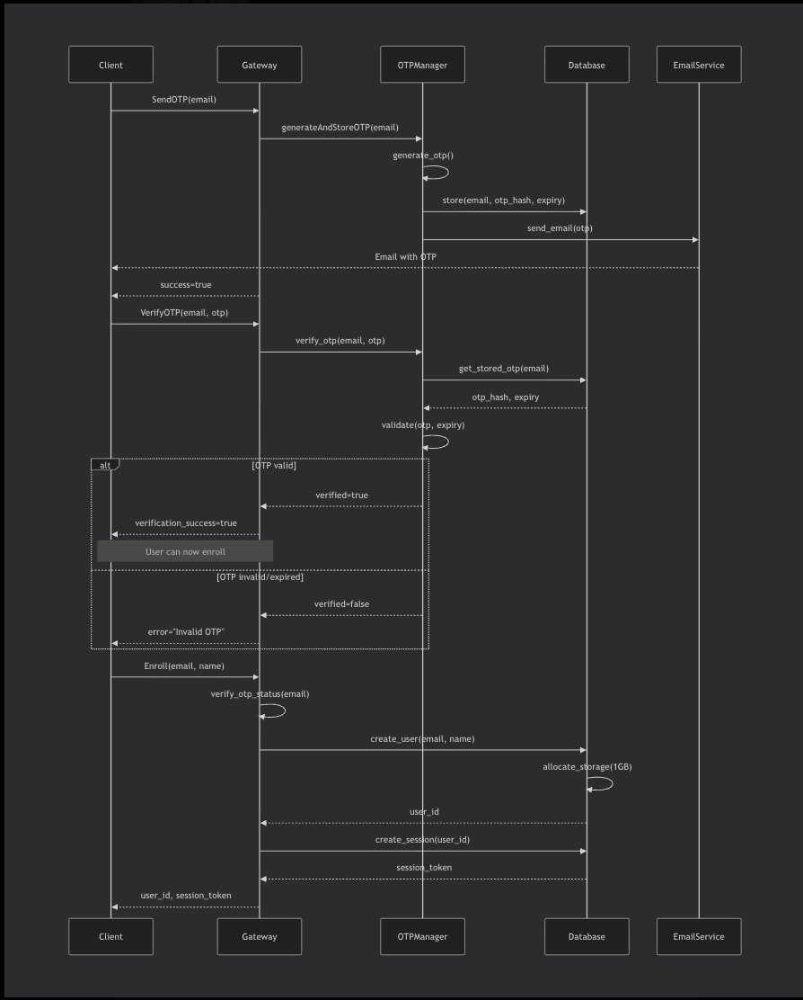
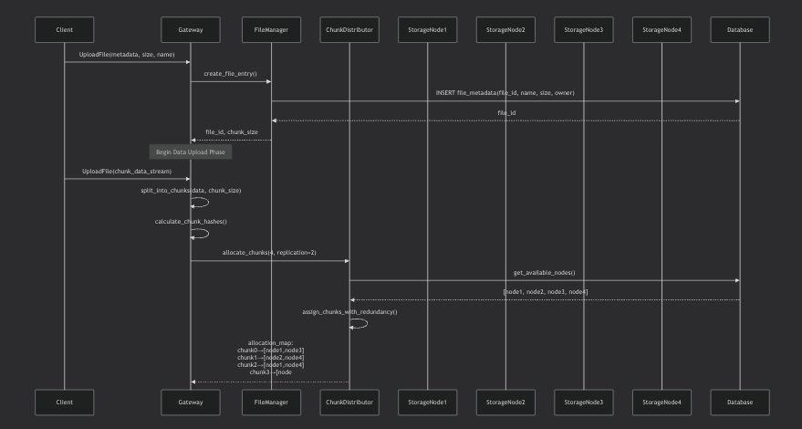
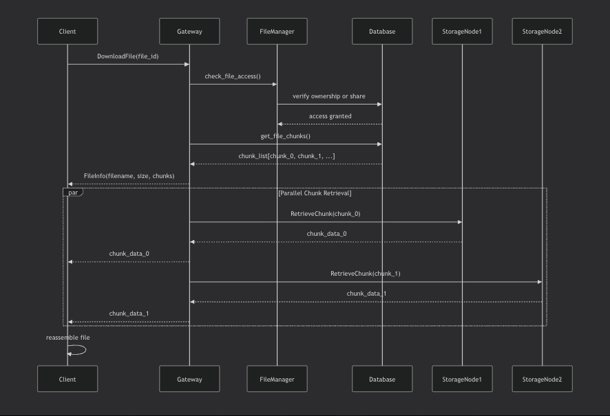
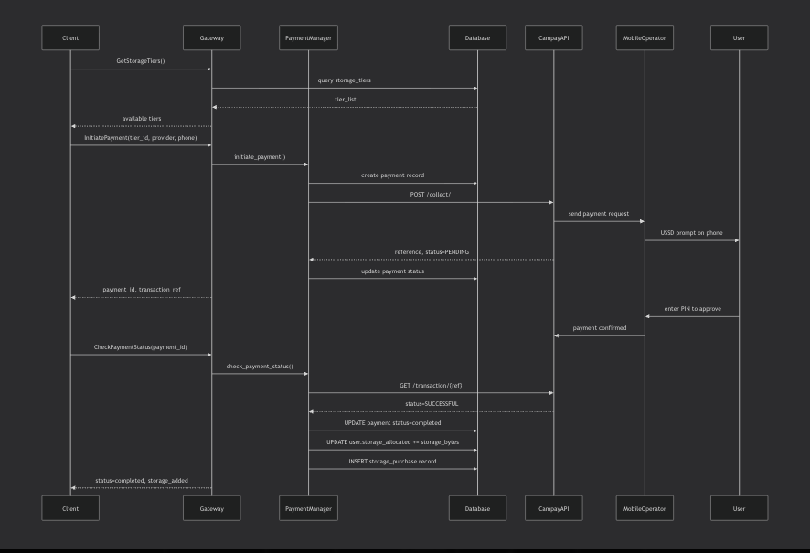
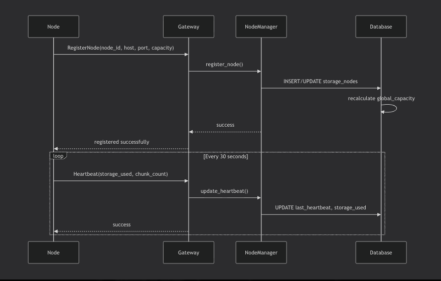
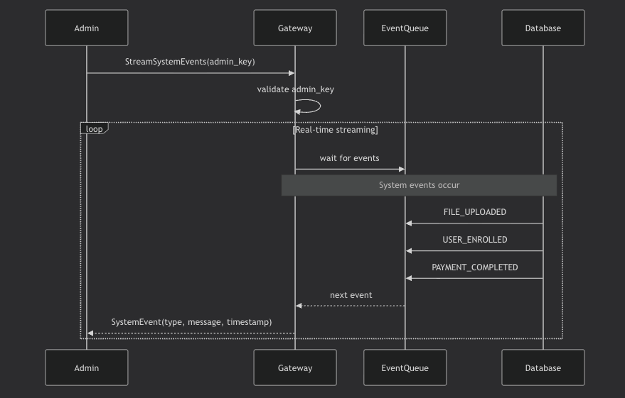

CloudGrpc Storage Platform
A distributed cloud storage system with integrated payment processing, built with gRPC and Python. Features include file chunking, distributed storage across multiple nodes, mobile money payments (MTN MoMo, Orange Money), and real-time administrative monitoring.


## 📌 Table of Contents
- [Features](#-features)
- [Architecture](#-architecture)
- [Prerequisites](#-prerequisites)
- [Installation](#-installation)
- [Configuration](#️-configuration)
- [Usage](#-usage)
- [API Documentation](#-api-documentation)
- [Sequence Diagrams](#-sequence-diagrams)
- [Project Structure](#-project-structure)
- [Payment Integration](#-payment-integration)
- [Development](#-development)
- [Troubleshooting](#-troubleshooting)
- [Performance Considerations](#-performance-considerations)
- [Security](#-security)
- [Deployment](#-deployment)
- [Contributing](#-contributing)
- [License](#-license)

---

## ✨ Features
### **Core Storage**

-Distributed File Storage: Files are split into chunks and distributed across multiple storage nodes
-Automatic Replication: Configurable replication factor for data redundancy
-Dynamic Storage Allocation: Storage capacity grows automatically as nodes are added
-File Sharing: Share files with other users with configurable permissions
-Folder Organization: Organize files in hierarchical folder structures
-Soft Delete: Files can be moved to trash before permanent deletion

### **Security**
- OTP-based authentication via Gmail  
- Expiring session tokens  
- Full user data isolation  

### **Payment System**
- MTN MoMo & Orange Money (Cameroon)  
- Campay API integration  
- Storage tiers (250MB → 2GB, customizable)  
- Payment history + automatic storage upgrade  
- Demo mode for testing  

### **Administration**
- Real-time event monitoring  
- System-wide statistics  
- Node health tracking  
- Payment analytics  

🏗 Architecture
System Components
┌─────────────────────────────────────────────────────────────┐
│ Client Applications │
│ (CLI Client, Admin Monitor, Payment Client) │
└────────────────────┬────────────────────────────────────────┘
│ gRPC
▼
┌─────────────────────────────────────────────────────────────┐
│ Cloud Gateway Server │
│ • Authentication Service • Payment Service │
│ • File Service • Storage Service │
│ • Admin Service • Node Service │
└────────────┬───────────────────────────┬────────────────────┘
│ │
│ gRPC │ PostgreSQL
▼ ▼
┌────────────────────────┐ ┌──────────────────────┐
│ Storage Nodes │ │ Database │
│ • node_storage_1 │ │ • Users & Sessions │
│ • node_storage_2 │ │ • Files & Chunks │
│ • node_storage_3 │ │ • Storage Nodes │
│ • node_storage_N │ │ • Payments │
└────────────────────────┘ └──────────────────────┘
Data Flow

Upload Flow: Client → Gateway → Chunk Distributor → Storage Nodes
Download Flow: Client → Gateway → Chunk Retriever → Storage Nodes
Payment Flow: Client → Gateway → Payment Manager → Campay API

📦 Prerequisites

Python 3.8 or higher
PostgreSQL 13 or higher
pip (Python package manager)
Gmail account (for OTP emails)
Campay account (for payments) - Optional for demo mode

🚀 Installation

1. Clone the Repository
   bashgit clone https://github.com/yourusername/cloudgrpc-storage.git
   cd cloudgrpc-storage
2. Create Virtual Environment
   bashpython -m venv venv

# Windows

venv\Scripts\activate

# macOS/Linux

source venv/bin/activate 3. Install Dependencies
bashpip install -r requirements.txt 4. Set Up PostgreSQL Database
sql-- Connect to PostgreSQL
psql -U postgres

-- Create database
CREATE DATABASE cloud_storage;

-- Create user (optional)
CREATE USER cloud_admin WITH PASSWORD 'your_secure_password';
GRANT ALL PRIVILEGES ON DATABASE cloud_storage TO cloud_admin; 5. Configure Environment Variables
Create a .env file in the project root:
env# Database Configuration
DB_HOST=localhost
DB_PORT=5432
DB_NAME=cloud_storage
DB_USER=postgres
DB_PASSWORD=your_database_password

# Server Configuration

GRPC_SERVER_HOST=localhost
GRPC_SERVER_PORT=50051

# Admin Configuration

ADMIN_KEY=your_secure_admin_key_here

# Gmail Configuration (for OTP)

GMAIL_USER=your_email@gmail.com
GMAIL_APP_PASSWORD=your_gmail_app_password

# Campay Configuration (Payment Gateway)

CAMPAY_APP_USERNAME=your_campay_username
CAMPAY_APP_PASSWORD=your_campay_password
CAMPAY_BASE_URL=https://demo.campay.net/api # Use demo URL for testing
Getting Gmail App Password:

Enable 2-factor authentication on your Google account
Go to Google Account → Security → 2-Step Verification → App passwords
Generate new app password for "Mail"
Use this 16-character password in .env

6. Generate Protocol Buffers
   bashpython generate_proto.py
   This creates the gRPC interfaces in the generated/ directory.
7. Initialize Database
   bash# Create all database tables
   python -c "from db.database import init_database; init_database()"

# Create payment tiers

python db/init_payment_tables.py

⚙️ Configuration
Storage Tiers
Default storage tiers are created automatically. To modify them, edit db/init*payment_tables.py:
pythondefault_tiers = [
{
'name': 'starter',
'display_name': 'Starter Pack',
'storage_bytes': 250 * 1024 \_ 1024, # 250 MB
'price_xaf': 500, # 500 XAF
'description': 'Perfect for light users'
},

# Add more tiers...

]
Node Configuration
Storage nodes can be configured with custom:

Storage capacity (GB)
Host and port
CPU cores

Payment Demo Mode
The system automatically detects Campay demo mode from the URL:

Demo URL: https://demo.campay.net/api (max 10 XAF per transaction)
Production URL: https://www.campay.net/api

🎯 Usage
Starting the System

1. Start the Cloud Gateway Server
   bashpython server/cloud_server.py

```

Expected output:
```

======================================================================
CLOUD STORAGE PLATFORM - SERVER (DYNAMIC STORAGE + PAYMENT SYSTEM)
======================================================================
Current Global Storage: 0 GB (no nodes registered)
Storage will grow as nodes are added!
Server listening on port 50051
Admin Key: your_admin_key
====================================================================== 2. Start Storage Nodes
Open separate terminals for each node:
bash# Node 1 - 2GB capacity
python node/storage_node.py node1 localhost 9001 2

# Node 2 - 2GB capacity

python node/storage_node.py node2 localhost 9002 2

# Node 3 - 2GB capacity

python node/storage_node.py node3 localhost 9003 2
Each node will:

Register with the gateway
Send periodic heartbeats
Store chunks in node_storage_nodeX/ directory

Using the CLI Client
Interactive Mode
bashpython client/cli.py
Commands:

enroll <email> <name> - Register new account
login <email> - Login to existing account
upload <file_path> - Upload a file
download <file_id> [output_path] - Download a file
list or ls - List files
delete <file_id> - Delete a file
storage - Show storage information
help - Show all commands
exit - Exit the CLI

Example Session
bash# Start CLI
python client/cli.py

# Enroll new user

> enroll user@example.com "John Doe"
> 📧 Sending OTP to user@example.com...
> ✓ OTP sent to your email!
> 📬 Enter the 6-digit OTP code: 123456
> 🔐 Verifying OTP...
> ✓ OTP verified!
> 📝 Creating your account...
> ✓ Successfully enrolled John Doe. Allocated 1 GB storage.

# Upload file

> upload test.pdf
> ℹ Uploading: test.pdf (2.5 MB)
> ✓ File uploaded successfully
> ℹ File ID: f7a3b2c1-4d5e-6f7g-8h9i-0j1k2l3m4n5o

# List files

> list
> 📄 FILES:

## Filename Size Type

test.pdf 2.5 MB application/pdf
ID: f7a3b2c1-4d5e-6f7g-8h9i-0j1k2l3m4n5o

# Download file

> download f7a3b2c1-4d5e-6f7g-8h9i-0j1k2l3m4n5o
> ✓ File downloaded to test.pdf
> Payment Client
> bash# List available storage tiers
> python client/payment_client.py tiers

# Interactive purchase

python client/payment_client.py buy --email user@example.com

# View payment history

python client/payment_client.py history --email user@example.com

# Check payment status

python client/payment_client.py status --payment-id <id> --email user@example.com
Admin Monitor
bash# Interactive admin dashboard
python admin/admin_monitor.py

# Quick status check

python admin/admin_monitor.py --status

# List all users

python admin/admin_monitor.py --users

# Real-time event monitoring

python admin/admin_monitor.py --monitor
Admin menu options:

View System Status
List All Users
List Storage Nodes
Get User Details
Start Real-Time Event Monitoring
Stop Event Monitoring
Refresh Display
Exit

📚 API Documentation
Authentication Service
SendOTP
Sends a one-time password to the user's email.
protobufrpc SendOTP (SendOTPRequest) returns (SendOTPResponse);

message SendOTPRequest {
string email = 1;
}

message SendOTPResponse {
bool success = 1;
string message = 2;
}
Example:
pythonresponse = auth_stub.SendOTP(
cloud_storage_pb2.SendOTPRequest(email="user@example.com")
)
VerifyOTP
Verifies the OTP code.
protobufrpc VerifyOTP (VerifyOTPRequest) returns (VerifyOTPResponse);

message VerifyOTPRequest {
string email = 1;
string otp = 2;
}

message VerifyOTPResponse {
bool success = 1;
string message = 2;
}
Enroll
Creates a new user account.
protobufrpc Enroll (EnrollRequest) returns (EnrollResponse);

message EnrollRequest {
string email = 1;
string full_name = 2;
}

message EnrollResponse {
bool success = 1;
string message = 2;
string session_token = 3;
string user_id = 4;
}
Login
Authenticates existing user.
protobufrpc Login (LoginRequest) returns (LoginResponse);

message LoginRequest {
string email = 1;
}

message LoginResponse {
bool success = 1;
string message = 2;
string session_token = 3;
string user_id = 4;
}
Logout
Invalidates user session.
protobufrpc Logout (LogoutRequest) returns (LogoutResponse);

message LogoutRequest {
string session_token = 1;
}

message LogoutResponse {
bool success = 1;
string message = 2;
}

File Service
UploadFile
Uploads a file using streaming.
protobufrpc UploadFile (stream UploadFileRequest) returns (UploadFileResponse);

message UploadFileRequest {
oneof data {
FileMetadata metadata = 1;
bytes chunk_data = 2;
}
}

message FileMetadata {
string session_token = 1;
string filename = 2;
int64 file_size = 3;
string mime_type = 4;
string parent_folder_id = 5;
}

message UploadFileResponse {
bool success = 1;
string message = 2;
string file_id = 3;
int32 chunks_stored = 4;
}
Example:
pythondef upload_iterator(): # First message: metadata
yield cloud_storage_pb2.UploadFileRequest(
metadata=cloud_storage_pb2.FileMetadata(
session_token=session_token,
filename="document.pdf",
file_size=1024000,
mime_type="application/pdf"
)
)

    # Subsequent messages: chunks
    with open("document.pdf", "rb") as f:
        while True:
            chunk = f.read(64 * 1024)  # 64KB chunks
            if not chunk:
                break
            yield cloud_storage_pb2.UploadFileRequest(chunk_data=chunk)

response = file_stub.UploadFile(upload_iterator())
DownloadFile
Downloads a file using streaming.
protobufrpc DownloadFile (DownloadFileRequest) returns (stream DownloadFileResponse);

message DownloadFileRequest {
string session_token = 1;
string file_id = 2;
}

message DownloadFileResponse {
oneof data {
FileInfo file_info = 1;
bytes chunk_data = 2;
}
}
ListFiles
Lists user's files and folders.
protobufrpc ListFiles (ListFilesRequest) returns (ListFilesResponse);

message ListFilesRequest {
string session_token = 1;
string folder_id = 2;
bool include_deleted = 3;
}

message ListFilesResponse {
bool success = 1;
repeated FileEntry files = 2;
repeated FolderEntry folders = 3;
}
DeleteFile
Deletes a file (soft or permanent).
protobufrpc DeleteFile (DeleteFileRequest) returns (DeleteFileResponse);

message DeleteFileRequest {
string session_token = 1;
string file_id = 2;
bool permanent = 3; // false = soft delete, true = permanent
}

message DeleteFileResponse {
bool success = 1;
string message = 2;
}
ShareFile
Shares a file with another user.
protobufrpc ShareFile (ShareFileRequest) returns (ShareFileResponse);

message ShareFileRequest {
string session_token = 1;
string file_id = 2;
string share_with_email = 3;
string permission = 4; // "read" or "write"
}

message ShareFileResponse {
bool success = 1;
string message = 2;
string share_token = 3;
}

Payment Service
GetStorageTiers
Retrieves available storage packages.
protobufrpc GetStorageTiers (GetStorageTiersRequest) returns (GetStorageTiersResponse);

message GetStorageTiersResponse {
bool success = 1;
repeated StorageTier tiers = 2;
}

message StorageTier {
string tier_id = 1;
string name = 2;
string display_name = 3;
int64 storage_bytes = 4;
int32 price_xaf = 5;
string description = 6;
}
InitiatePayment
Starts a mobile money payment.
protobufrpc InitiatePayment (InitiatePaymentRequest) returns (InitiatePaymentResponse);

message InitiatePaymentRequest {
string session_token = 1;
string tier_id = 2;
string provider = 3; // "mtn_momo" or "orange_money"
string phone_number = 4; // Format: 237XXXXXXXXX
}

message InitiatePaymentResponse {
bool success = 1;
string message = 2;
string payment_id = 3;
string transaction_ref = 4;
int32 amount_xaf = 5;
}
CheckPaymentStatus
Checks payment transaction status.
protobufrpc CheckPaymentStatus (CheckPaymentStatusRequest) returns (CheckPaymentStatusResponse);

message CheckPaymentStatusRequest {
string session_token = 1;
string payment_id = 2;
}

message CheckPaymentStatusResponse {
bool success = 1;
string payment_id = 2;
string status = 3; // "pending", "processing", "completed", "failed"
string message = 4;
int64 storage_added = 5;
}
GetPaymentHistory
Retrieves user's payment history.
protobufrpc GetPaymentHistory (GetPaymentHistoryRequest) returns (GetPaymentHistoryResponse);

message GetPaymentHistoryRequest {
string session_token = 1;
int32 limit = 2;
}

message GetPaymentHistoryResponse {
bool success = 1;
repeated PaymentRecord payments = 2;
}

Storage Service
GetStorageInfo
Gets user's storage allocation and usage.
protobufrpc GetStorageInfo (StorageInfoRequest) returns (StorageInfoResponse);

message StorageInfoRequest {
string session_token = 1;
}

message StorageInfoResponse {
bool success = 1;
int64 allocated_bytes = 2;
int64 used_bytes = 3;
int64 available_bytes = 4;
double usage_percentage = 5;
}

Admin Service
GetSystemStatus
Retrieves comprehensive system statistics.
protobufrpc GetSystemStatus (SystemStatusRequest) returns (SystemStatusResponse);

message SystemStatusRequest {
string admin_key = 1;
}

message SystemStatusResponse {
bool success = 1;
int64 global_capacity_bytes = 2;
int64 global_allocated_bytes = 3;
int64 global_used_bytes = 4;
int32 total_users = 5;
int32 total_nodes = 6;
int32 online_nodes = 7;
int64 total_files = 8;
int64 total_chunks = 9;
double system_health = 10;
}
ListAllUsers
Lists all registered users.
protobufrpc ListAllUsers (ListUsersRequest) returns (ListUsersResponse);

message ListUsersRequest {
string admin_key = 1;
}

message ListUsersResponse {
bool success = 1;
repeated UserInfo users = 2;
}
StreamSystemEvents
Streams real-time system events.
protobufrpc StreamSystemEvents (StreamEventsRequest) returns (stream SystemEvent);

message StreamEventsRequest {
string admin_key = 1;
}

message SystemEvent {
string event_type = 1;
string timestamp = 2;
string message = 3;
string user_id = 4;
string details = 5;
}

🔄 Sequence Diagrams
User Enrollment Flow


File Upload Flow


File Download Flow



Payment Flow


Storage Node Registration Flow


Admin Monitoring Flow


```

---

## 📁 Project Structure
```

CLI_Cloud_Platform_2.0/
├── admin/ # Administrative tools
│ ├── admin_monitor.py # Real-time monitoring dashboard
│ └── **init**.py
│
├── auth/ # Authentication module
│ ├── gmail_otp.py # OTP generation and email
│ └── **init**.py
│
├── client/ # Client applications
│ ├── cli.py # Command-line interface
│ ├── cloud_client.py # gRPC client library
│ ├── payment_client.py # Payment operations client
│ └── **init**.py
│
├── db/ # Database layer
│ ├── database.py # Database connection & sessions
│ ├── models.py # SQLAlchemy models
│ ├── init_payment_tables.py # Payment system setup
│ └── **init**.py
│
├── file/ # File management
│ ├── file_manager.py # File operations & metadata
│ └── **init**.py
│
├── generated/ # Auto-generated from proto
│ ├── cloud_storage_pb2.py
│ ├── cloud_storage_pb2_grpc.py
│ └── **init**.py
│
├── node/ # Storage nodes
│ ├── storage_node.py # Node server implementation
│ └── **init**.py
│
├── payment/ # Payment system
│ ├── campay_client.py # Campay API integration
│ ├── payment_manager.py # Payment processing logic
│ └── **init**.py
│
├── proto/ # Protocol Buffers definitions
│ └── cloud_storage.proto
│
├── server/ # Cloud gateway server
│ ├── cloud_server.py # Main gRPC server
│ └── **init**.py
│
├── storage/ # Storage management
│ ├── chunk_distributor.py # Chunk placement algorithm
│ ├── node_manager.py # Node registry & health
│ └── **init**.py
│
├── user/ # User management
│ ├── user_manager.py # User operations & sessions
│ └── **init**.py
│
├── utils/ # Utility functions
│ ├── helpers.py # Common helpers
│ └── **init**.py
│
├── .env # Environment configuration
├── .gitignore
├── generate_proto.py # Proto compilation script
├── requirements.txt # Python dependencies
└── README.md # This file

💳 Payment Integration
Campay Setup

Create Campay Account

Visit Campay.net
Register for merchant account
Complete verification process

Get API Credentials

Login to Campay dashboard
Navigate to Settings → API Keys
Copy App Username and App Password

Configure Environment

env CAMPAY_APP_USERNAME=your_username
CAMPAY_APP_PASSWORD=your_password
CAMPAY_BASE_URL=https://demo.campay.net/api # Demo mode

# CAMPAY_BASE_URL=https://www.campay.net/api # Production mode

```

### Payment Flow

1. **User Initiates Payment**
   - Selects storage tier
   - Chooses payment provider (MTN/Orange)
   - Enters phone number

2. **System Processes**
   - Creates payment record in database
   - Sends collection request to Campay
   - Campay sends USSD prompt to user's phone

3. **User Confirms**
   - Receives USSD notification on phone
   - Enters mobile money PIN
   - Confirms transaction

4. **Storage Allocation**
   - System receives payment confirmation
   - Automatically adds storage to user account
   - Creates purchase record

### Testing Payments

**Demo Mode** (automatically detected):
- Maximum amount: 10 XAF per transaction
- All transactions succeed immediately
- No real money transferred

**Test Phone Numbers**:
```

MTN: 237670000001 - 237670000010
Orange: 237690000001 - 237690000010
Test Transaction Flow:
bash# 1. Start payment client
python client/payment_client.py buy --email test@example.com

# 2. Select tier (e.g., Starter Pack)

# 3. Select provider (MTN or Orange)

# 4. Enter test phone number

# 5. In demo mode, payment succeeds automatically

# 6. Check payment status

python client/payment*client.py status --payment-id <id> --email test@example.com
🛠 Development
Adding New Storage Tiers
Edit db/init_payment_tables.py:
python{
'name': 'enterprise',
'display_name': 'Enterprise Pack',
'storage_bytes': 10 * 1024 \_ 1024 \* 1024, # 10 GB
'price_xaf': 10000, # 10,000 XAF
'description': 'For business users - add 10 GB'
}
Run:
bashpython db/init_payment_tables.py
Modifying Proto Definitions

Edit proto/cloud_storage.proto
Regenerate Python code:

bash python generate_proto.py

Update server and client implementations

Adding New Node
bashpython node/storage_node.py node4 localhost 9004 5
Storage capacity automatically added to global pool.

🐛 Troubleshooting
Database Connection Issues
bash# Check PostgreSQL is running
sudo systemctl status postgresql

# Test connection

psql -U postgres -d cloud_storage

# Reset database

python -c "from db.database import db; db.drop_tables(); db.create_tables()"
OTP Email Not Sending

Verify Gmail app password is correct
Check 2FA is enabled on Google account
For macOS: Ensure port 465 is not blocked
Test mode fallback: OTP will print to console

Payment Failures

Verify Campay credentials in .env
Check demo mode URL is correct
Validate phone number format: 237XXXXXXXXX
Review payment logs in admin monitor

Node Registration Failures

Ensure gateway server is running first
Check node ports are not in use
Verify network connectivity
Review node logs for errors

Storage Quota Issues
bash# Check user storage via admin monitor
python admin/admin_monitor.py

# Manually adjust user quota (admin)

python -c "
from db.database import get_db_session
from db.models import User
with get_db_session() as session:
user = session.query(User).filter_by(email='user@example.com').first()
user.storage_allocated = 5 \* 1024\*\*3 # 5 GB
"

📊 Performance Considerations
File Upload Optimization

Chunk Size: Default 64KB for network transfer
Parallel Uploads: Chunks uploaded concurrently
Compression: Consider implementing compression for text files
Deduplication: Future enhancement for identical chunks

Scalability

Horizontal Scaling: Add more storage nodes dynamically
Load Balancing: Chunk distributor balances across nodes
Database: Connection pooling (max 20 connections)
Node Selection: Health-based algorithm prioritizes best nodes

Monitoring Metrics

Total storage capacity vs. used
Node health scores
Upload/download speeds
Payment success rates
Active user sessions

🔒 Security
Authentication

OTP-based email verification
Session tokens expire after 24 hours
Secure password hashing (future enhancement)

Data Protection

User data isolation at database level
File access controlled by ownership and shares
Admin operations require admin key

Payment Security

Sensitive credentials in environment variables
PCI compliance through Campay gateway
Transaction verification before storage allocation

Recommendations

Use HTTPS/TLS in production
Implement rate limiting
Regular security audits
Encrypt sensitive data at rest

🚀 Deployment
Production Checklist

Update database credentials
Configure production Campay URL
Set strong admin key
Enable SSL/TLS for gRPC
Set up PostgreSQL replication
Configure backup strategy
Set up monitoring and alerting
Review and adjust storage tiers
Load test with expected traffic
Document disaster recovery procedures

Docker Deployment (Future Enhancement)
yaml# docker-compose.yml (example)
version: '3.8'

services:
postgres:
image: postgres:13
environment:
POSTGRES_DB: cloud_storage
POSTGRES_PASSWORD: ${DB_PASSWORD}
volumes: - postgres_data:/var/lib/postgresql/data

gateway:
build: .
command: python server/cloud_server.py
ports: - "50051:50051"
depends_on: - postgres
environment: - DB_HOST=postgres

node1:
build: .
command: python node/storage_node.py node1 0.0.0.0 9001 10

volumes:
postgres_data:

🤝 Contributing
We welcome contributions! Please follow these guidelines:
How to Contribute

Fork the repository
Create a feature branch

bash git checkout -b feature/amazing-feature

Make your changes
Test thoroughly
Commit with clear messages

bash git commit -m "Add amazing feature"

Push to your fork

bash git push origin feature/amazing-feature

```
7. **Open a Pull Request**

### Code Style

- Follow PEP 8 for Python code
- Use descriptive variable and function names
- Add docstrings to functions and classes
- Comment complex logic

### Testing

- Test all new features locally
- Ensure existing functionality works
- Test error handling and edge cases

---

## 📝 License

This project is licensed under the MIT License - see below for details:
```

MIT License

Copyright (c) 2024 CloudGrpc Storage Platform

Permission is hereby granted, free of charge, to any person obtaining a copy
of this software and associated documentation files (the "Software"), to deal
in the Software without restriction, including without limitation the rights
to use, copy, modify, merge, publish, distribute, sublicense, and/or sell
copies of the Software, and to permit persons to whom the Software is
furnished to do so, subject to the following conditions:

The above copyright notice and this permission notice shall be included in all
copies or substantial portions of the Software.

THE SOFTWARE IS PROVIDED "AS IS", WITHOUT WARRANTY OF ANY KIND, EXPRESS OR
IMPLIED, INCLUDING BUT NOT LIMITED TO THE WARRANTIES OF MERCHANTABILITY,
FITNESS FOR A PARTICULAR PURPOSE AND NONINFRINGEMENT. IN NO EVENT SHALL THE
AUTHORS OR COPYRIGHT HOLDERS BE LIABLE FOR ANY CLAIM, DAMAGES OR OTHER
LIABILITY, WHETHER IN AN ACTION OF CONTRACT, TORT OR OTHERWISE, ARISING FROM,
OUT OF OR IN CONNECTION WITH THE SOFTWARE OR THE USE OR OTHER DEALINGS IN THE
SOFTWARE.
